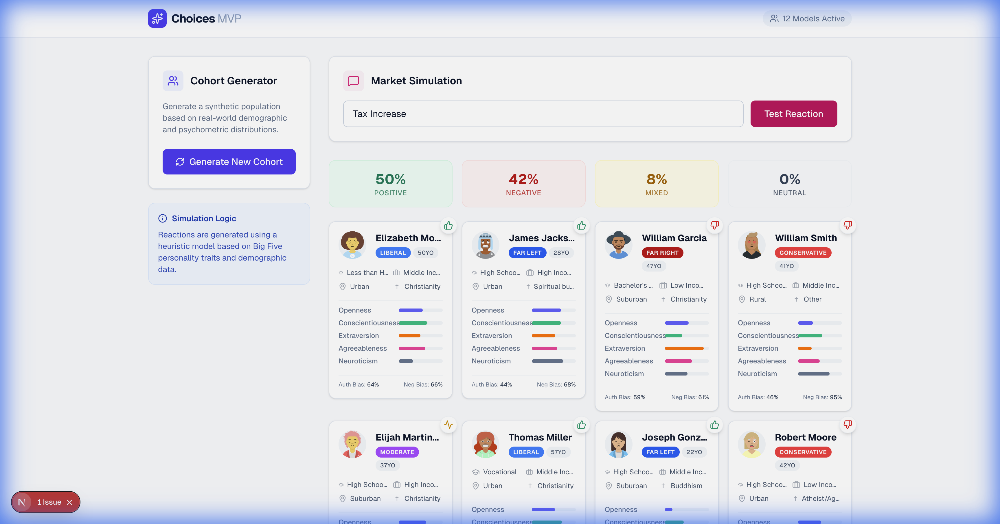

# Choices MVP

**Choices** is a web application that generates diverse, synthetic "people" models and simulates their reactions to various topics, products, or policies. The simulation uses heuristic logic based on real-world psychological frameworks (Big Five Personality Traits) and demographic distributions.



## Features

-   **Synthetic Cohort Generation**: Create realistic person profiles with diverse backgrounds (Race, Education, Religion) and personality traits.
-   **Detailed Personas**: View individual profiles including Political Affiliation, Cognitive Biases, and Psychographics.
-   **Market Simulation**: Input any topic (e.g., "Universal Basic Income", "New iPhone") and see how the cohort reacts.
-   **Heuristic Engine**: Reactions are calculated based on the alignment between the topic and the person's attributes.

## Tech Stack

-   **Framework**: Next.js 15 (App Router)
-   **Language**: TypeScript
-   **Styling**: Tailwind CSS
-   **Icons**: Lucide React

## Getting Started

1.  Clone the repository:
    ```bash
    git clone https://github.com/kohl-99/Choices.git
    cd Choices
    ```

2.  Install dependencies:
    ```bash
    npm install
    ```

3.  Run the development server:
    ```bash
    npm run dev
    ```

4.  Open [http://localhost:3000](http://localhost:3000) with your browser.

## Simulation Logic

The "AI" in this MVP is a deterministic heuristic engine located in `src/lib/simulator.ts`. It calculates a sentiment score based on:
-   **Openness**: High openness flavors new/innovative topics positively.
-   **Conscientiousness**: Affects skepticism and detail-oriented feedback.
-   **Political Leanings**: Influences reactions to politically coded keywords.
-   **Biases**: Negativity and Status Quo biases skew the final sentiment.
